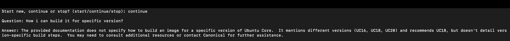

# Q&A Chatbot with Vector Store

## Introduction

This repository demonstrates a **Q&A Chatbot** that utilizes a vector store and a **Language Model (LLM)** to retrieve and generate answers for user queries. By creating embeddings from Ubuntu documentation (in Markdown format) and storing them in a vector database, the chatbot efficiently finds relevant context to produce accurate responses.

## Objectives

1. **Vector Store Creation**  
   - Create a local vector store using FAISS from the Ubuntu documentation in Markdown format.  
   - Generate embeddings using the Google AI Studio API model.

2. **Chatbot Development**  
   - Develop a chatbot that interprets user queries and retrieves pertinent chunks from the vector store.  
   - Utilize Gemini 1.5 Pro from Google AI Studio to generate final answers.

3. **Bonus Tasks**  
   - **FastAPI Endpoints**:  
     - Implement a FastAPI endpoint in `fastapiapp.py` to serve the chatbot locally and test it via Swagger.  
     - Create a small FastAPI endpoint in `app.py` to deploy the application locally and record the results of hitting the solution endpoint via Swagger.
   - **Docker Deployment**:  
     - Deploy the solution using Docker and test it via Swagger.

## Project Files & Structure

Below is an example of the updated folder structure, including the pre-built container image file:

```
project/
├── __pycache__/
├── demo_bot_data/
│   └── [Ubuntu Markdown Docs ...]
├── faiss_ubuntu_docs/
├── Outputs/
│   ├── fastapidemo1.JPG
│   ├── fastapidemo2.JPG
│   ├── fastapidemo3.JPG
│   ├── fastapidemo4.JPG
│   ├── localdemo1.JPG
│   ├── localdemo2.JPG
│   ├── localdemo3.JPG
│   ├── localdemo4.JPG
│   └── Vid_demo.MP4
├── app.py
├── con_qa_chain.py
├── config.py
├── document_loader.py
├── fastapiapp.py
├── my-qabot-image.tar
├── requirements.txt
├── vector_store.py
└── README.md
```

### Key Folders & Files

- **demo_bot_data/**: Contains your Ubuntu Markdown documentation and any other demo data.
- **faiss_ubuntu_docs/**: Contains the FAISS vector store for Ubuntu docs.
- **Outputs/**: Contains screenshots and a demo video showcasing the chatbot in action.
- **app.py**: To locally run the application on the terminal.
- **fastapiapp.py**: A FastAPI endpoint to serve the chatbot and test it via Swagger (Bonus Task).
- **con_qa_chain.py**: Configures the chatbot’s retrieval and answer generation chain.
- **document_loader.py**: Loads, chunks, and embeds documents into the vector store.
- **vector_store.py**: Contains logic for initializing and querying the FAISS vector database.
- **my-qabot-image.tar**: The pre-built container image file.
- **requirements.txt**: Lists all required Python packages.

## Docker Deployment & Usage

pre-built container image (`my-qabot-image.tar`), load and run it using the following steps:

1. **Load the Pre-Built Image:**

   ```bash
   docker load -i my-qabot-image.tar
   ```

2. **Run the Container:**

   ```bash
   docker run -d -p 8000:8000 --name my-qabot-container my-qabot-image:latest
   ```

3. **Test via Swagger:**

   Open your browser at [http://127.0.0.1:8000/docs](http://127.0.0.1:8000/docs) to interact with the Swagger UI.

Use these commands to deploy and test the solution using Docker.

## Local Deployment & Testing (Without Docker)

1. **Environment Setup**  
   Install required packages:
   ```bash
   pip install -r requirements.txt
   ```


2. **FastAPI Endpoints**

   - **Using `fastapiapp.py`**:  
     Start the FastAPI server with:
     ```bash
     uvicorn fastapiapp:app --reload
     ```
     Then, access the Swagger UI at [http://127.0.0.1:8000/docs](http://127.0.0.1:8000/docs).

   - **Using `app.py`**:  
     Alternatively, to test in the terminal:
     ```bash
     python app.py
     ```
    


## Demonstration

Screenshots and a demo video of the chatbot in action are available in the **Outputs/** folder.

### Screenshots

Below are embedded screenshots showcasing different stages of the chatbot:





### Video Demonstration

A full video demonstration of the chatbot in action can be viewed here:

[]

**Thank you for exploring this Q&A Chatbot!**
